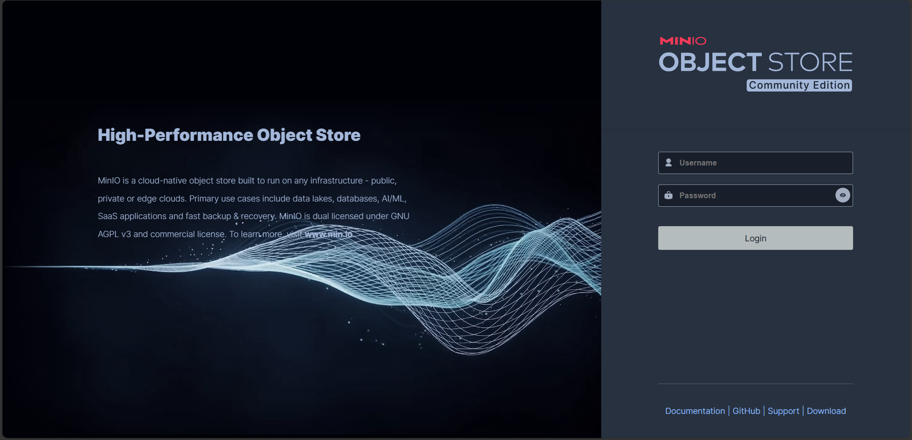
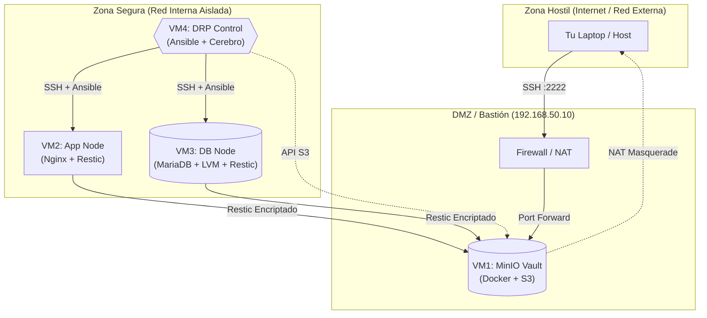

# Sistema de Resiliencia Operativa y DRP (Plan de Recuperación ante Desastres)

----
## Descripción del Proyecto

### El Problema: 
En la administración de sistemas tradicional, los backups suelen fallar silenciosamente. Los scripts de copia (`cp`, `rsync`) no garantizan la consistencia si la base de datos está escribiendo en ese momento, y la recuperación manual ("DRP en papel") es lenta y propensa a errores humanos bajo presión.

> **Si un backup no ha sido probado mediante una restauración, no existe.**

### La Solución
Este proyecto implementa un **Sistema de Resiliencia Automatizada** diseñado para cumplir con los estándares de **Continuidad Operacional**. Transformamos el DRP en código ejecutable para garantizar que la recuperación sea:
1.  **Consistente:** Uso de **LVM Snapshots** para "congelar" el estado del disco en milisegundos, asegurando que la base de datos (MariaDB) nunca se copie en un estado corrupto.
2.  **Eficiente:** Implementación de **Restic** para backups incrementales con deduplicación. Solo se transmiten y almacenan los bytes que han cambiado, reduciendo el uso de red y almacenamiento.
3.  **Gestionada:** Aplicación de políticas de retención **GFS (Grandfather-Father-Son)** automáticas para mantener copias históricas sin saturar el almacenamiento.
4.  **Inmortal:** Orquestación con **Ansible** para automatizar la resurrección completa del servicio en minutos, eliminando el factor humano durante la crisis.

---

##  Arquitectura de la Solución

El sistema se distribuye en **4 Nodos Lógicos** interconectados, diseñados para simular un entorno de producción real donde los servicios (App/DB), el almacenamiento (Backups) y la gestión (Control) están desacoplados para garantizar la supervivencia de los datos incluso si los servidores principales son comprometidos.

# AQUI PONDREMOS LA TOPOLOGIA


| Nodo | Rol | Función Crítica |
| :--- | :--- | :--- |
| **VM1** | `Bóveda (Storage)` | Almacenamiento inmutable de backups (MinIO). Actúa como "caja negra" externa. |
| **VM2** | `App Node` | Servidor Web (Nginx/Apache). Representa la cara visible del negocio. |
| **VM3** | `DB Node` | Base de Datos (MariaDB) sobre lúmenes LVM. Es el activo más valioso. |
| **VM4** | `Cerebro (Control)` | Nodo de gestión desde donde Ansible ejecuta la recuperación automática. |

---

## Tecnologías Seleccionadas

### 1. Motor de Backup: Restic

* **¿Por qué?** **Restic** utiliza una arquitectura de **"Chunk-Based Deduplication"** (Deduplicación basada en fragmentos).
* **Eficiencia:** Si cambias 1 MB en una base de datos de 10 GB, Restic solo transfiere y guarda ese 1 MB. Esto cumple con el requisito de **estrategia incremental** sin la complejidad de gestionar cadenas de incrementales frágiles.
* **Seguridad:** Todo dato que sale del servidor es cifrado con **AES-256** (Cifrado simétrico fuerte con una longitud clave de 256 bits) antes de tocar la red.

### 2. Consistencia de Datos: LVM (Logical Volume Manager)
> *Requisito: Integridad en Caliente*

* **El Desafío:** Copiar los archivos de una base de datos mientras está encendida resulta en backups corruptos e inutilizables.
* **La Solución:** Utilizamos **Snapshots LVM**. Esto "congela" el sistema de archivos en el tiempo exacto en milisegundos, permitiendo a Restic copiar los datos estáticos mientras la base de datos sigue recibiendo escrituras en un espacio temporal.

### 3. Planificación: Systemd Timers

* **La Mejora:** **Systemd** maneja dependencias (ej: *"no inicies el backup si no hay red"*), reintentos automáticos si falla la conexión, y registro de logs centralizado (`journalctl`). Es vital para la **Automatización** robusta.

### 4. Orquestación DRP: Ansible
> *Requisito: Automatización de la Restauración*

* **¿Por qué?** Un Plan de Recuperación ante Desastres (DRP) documentado en papel es lento y propenso a error humano durante una crisis.
* **La Solución:** Transformamos el DRP en **Playbooks de Ansible**. Esto nos permite reconstruir el servicio, reinstalar dependencias y restaurar los datos con un solo comando, reduciendo el **RTO (Recovery Time Objective)** de horas a minutos.

---
##  Estrategia de Retención de Datos

### Perfil Producción (GFS en un entorno serio)
En un entorno empresarial real, aplicamos el esquema estándar **Grandfather-Father-Son** para cumplir con auditorías y recuperación a largo plazo:

* **Son (Diario):** `--keep-daily 7` (Mantiene 1 backup por día durante una semana).
* **Father (Semanal):** `--keep-weekly 4` (Mantiene 1 por semana durante un mes).
* **Grandfather (Mensual):** `--keep-monthly 6` (Mantiene 1 por mes durante medio año).

### Perfil Demostración (Para la demostracion para la feria)
> Debido a la naturaleza efímera del evento (ciclos de vida de minutos), hemos ajustado el "cronómetro" para operar en **Alta Frecuencia**:

* **Frecuencia de Backup:** Cada **60 segundos** (Systemd Timer).
* **Política de Retención:** `keep-last 20`.
    * *Justificación:* Esto nos permite viajar en el tiempo minuto a minuto durante la presentación, mostrando cambios inmediatos sin esperar días o semanas.


> *Esto demuestra la capacidad de Restic para gestionar el ciclo de vida de los datos sin intervención humana, escalando desde minutos (demo) hasta años (producción).*

---

##  Protocolo de Integridad 
Un riesgo crítico en sistemas automatizados es que el backup automático se ejecute *justo después* de un incidente destructivo, guardando un estado "vacío" o corrupto como el más reciente (`latest`).

**Nuestra Solución: Restauración por ID Inmutable.**
En lugar de restaurar ciegamente la etiqueta `latest`, nuestro **Menú de Control (Ansible)** permite al operador seleccionar un **Snapshot ID** específico.
1.  El sistema sigue haciendo backups (incluso del desastre), lo cual sirve como registro forense.
2.  El operador visualiza la línea de tiempo.
3.  Se selecciona el punto de restauración *previo* al incidente (T-1 minuto).

> **Resiliencia no es solo guardar datos, Tambien debemos saber a que version restaurar.**

***

# Fases de Implementación

Para garantizar la replicabilidad y el éxito del **Sistema de Resiliencia Operativa**, hemos dividido la ejecución en 9 fases estratégicas. Cada fase construye una capa de funcionalidad sobre la anterior, desde la infraestructura física hasta la interfaz de usuario final.

-----

## Fase 1: Aprovisionamiento de Infraestructura Base
**Descripción:**
Consiste en la creación y configuración inicial de los 4 Nodos Virtuales (VMs) que compondrán el sistema. Se establecen los recursos de hardware virtual (CPU, RAM, Disco) y se instala el sistema operativo base (Ubuntu Server).

**Objetivo y Aporte:**
* Establecer los cimientos del sistema.
* Segregar funciones: Separar la lógica de negocio (App/DB), el almacenamiento (Bóveda) y la gestión (Control) para evitar un "Punto Único de Fallo" (SPOF).

### Paso 1: Definición del Hardware Virtual

**📋 Descripción:**
Vamos a configurar "el chasis" de nuestras 4 máquinas virtuales en **VirtualBox**. Dado que son 4 computadoras físicas, se creara **una VM en cada laptop**.

Configura cada VM con los siguientes parámetros críticos:

| VM | Rol | RAM | CPU | Disco Principal (OS) | Discos Extra | Red |
| :--- | :--- | :--- | :--- | :--- | :--- | :--- |
| **VM1** | `minio-vault` | 2048 MB | 2 | 25 GB (VDI Dinámico) | **+20 GB** (VDI para Backups) | NAT |
| **VM2** | `app-node` | 2048 MB | 1 | 25 GB (VDI Dinámico) | - | NAT |
| **VM3** | `db-node` | 2048 MB | 2 | 25 GB (VDI Dinámico) | **+10 GB** (VDI para LVM) | NAT |
| **VM4** | `drp-control` | 2048 MB | 1 | 25 GB (VDI Dinámico) | - | NAT |

> **Nota Crítica:** En la configuración de Red de VirtualBox, debe estar en **"NAT"**. Esto aísla la VM pero le da salida a internet usando la IP de la maquina fisica.

Establece los límites físicos de nuestros servidores. Asignar discos secundarios a la VM1 y VM3 es vital porque simula la separación profesional entre "Sistema Operativo" y "Datos Críticos". Si el OS explota, el disco de datos sobrevive.

Tener los 4 contenedores virtuales listos para recibir el sistema operativo, con el almacenamiento físico segregado correctamente para cumplir con los requisitos de LVM y Backups.

---
Recibido. Cambio de variables aceptado.
Usar usuarios distintos (`minio`, `app`, `db`, `drp`) es una práctica excelente para auditoría (sabes quién rompió qué) y refleja la realidad de un equipo distribuido.

Procedemos con el **Paso 2**. Aquí es donde el software toca el metal.

***

### Paso 2: Instalación del OS y Definición de Identidad

**Descripción:**
Instalación del sistema operativo **Ubuntu Server (LTS)** en cada una de las 4 máquinas virtuales.

**Objetivo:**
Tener 4 servidores Linux arrancando, con acceso a internet y servicio SSH activo.

Al instalar y llenar los campos de
Your name:  
Your servers name:  
Pick a username:  
choose a password:  
nosotros para esta documentacion y el proyecto trabajeremos con:
| Rol | Your name | Your servers name | Pick a username | choose a password |
|---------|---------|---------|---------|---------|
|`minio-vault`| Admin Vault | minio-vault | admin-vault | 1234 |
|`app-node`| Admin App | app-node | admin-app | 4321 |
|`db-node`| Admin DB | db-node | admin-db | 5678 |
|`drp-control`| Admin DRP | drp-control | admin-drp | 8765 |
> En un entorno real se debe tener discrecion con las contraseñas  
> En este caso usaremos estos datos, pero si se desea replicar se debe ajustar algunos comandos a sus datos.

-----

### Paso 5: agregar y verificar Discos en caso de que no se haya hecho aun. 
Verificaremos si el sistema operativo reconoce los discos secundarios (`sdb`). Si no están, apagaremos las máquinas y los "enchufaremos" virtualmente.
Confirmar que `minio-vault` tiene su bóveda de 20GB y `db-node` tiene su disco para snapshots de 10GB.

1.  **Apagar Máquina:** `sudo poweroff` (en `minio-vault` y `db-node`).
2.  **VirtualBox:**
      * Selecciona la VM.
      * Clic en **Configuración** \> **Almacenamiento**.
      * Junto a "Controlador: SATA", clic en el icono de **"Añadir Disco Duro"**.
        
      * **Crear** \> **VDI** \> **Reservado dinámicamente**.
      * **Tamaño:**
          * Para `minio-vault`: **20 GB**.
          * Para `db-node`: **10 GB**.
      * **Aceptar**.
3.  **Encender Máquina:** Inicia la VM de nuevo.
4.  **Verificar:** Corre `lsblk`. Ahora debería aparecer `sdb`.

> **Nota:** Aun no los vamos a formatearlos o montarlos todavía. De eso nos encargaremos en las fases de MinIO y LVM respectivamente.

**Una observación sobre tu tabla:**
Veo que le asignaste **1024 MB de RAM** a todas las máquinas.

  * **Advertencia:** `minio-vault` (VM1) va a correr Docker + MinIO. Con 1GB de RAM va a estar apretado. Si tu laptop física tiene memoria de sobra, súbele a **2048 MB** a la VM1 ahora que estás reiniciando. Si no, déjalo en 1GB, pero no le pidas peras al olmo si va un poco lento.

¿Confirmas que `lsblk` muestra los discos `sdb` en VM1 y VM3?
Si es afirmativo, di **"Discos Listos"** y lanzamos la **Fase 2: La Bóveda**.


------

## Fase 2: Implementación de Red de Malla (Overlay Network)
**Descripción:**
Despliegue de una red privada virtual (VPN de malla) utilizando **Tailscale/ZeroTier**. Esto crea una capa de red abstracta sobre la infraestructura física, permitiendo que las máquinas se comuniquen de forma segura y encriptada sin depender de la configuración del router local (Wi-Fi de la feria o laboratorio).

**Objetivo y Aporte:**
* **Portabilidad Total:** El sistema funciona idénticamente en el laboratorio, en una feria pública o en Internet.
* **Independencia de IP:** Uso de *MagicDNS* para resolver nombres (`db-node`, `app-node`) en lugar de depender de IPs estáticas frágiles.
* **Seguridad:** Todo el tráfico entre nodos viaja cifrado, inmune a espionaje en redes públicas.


### Paso 3: Despliegue de la Red Overlay (Tailscale)
Para trabajar este proyecto de forma remota usaremos Tailscale.
**Descripción:**
Instalación del cliente **Tailscale** en los 4 nodos. Tailscale es una VPN de malla (Mesh VPN) basada en el protocolo **WireGuard** (famoso por ser ligero y seguro).
A diferencia de las VPN tradicionales que redirigen todo el tráfico a un servidor central lento, Tailscale crea túneles encriptados punto-a-punto (P2P) entre las máquinas.

**Objetivo:**
Lograr que `minio-vault` pueda hacer ping a `db-node` usando solo su nombre, independientemente de la red física a la que estén conectados.

-----

### Procedimiento de Conexión

*Instrucciones para el equipo: Realizar en las 4 máquinas simultáneamente.*

**1. Registro en la Plataforma (Solo uno, cualquiera)**

  * Entrar a [tailscale.com](https://tailscale.com) y crear una cuenta gratuita (usar GitHub o Google).
  * Te aparece la opcion de agregar dispositivo, escojemos linux, en la parte inferior nos muestra un comando.

**2. Instalación del Agente**
En cada una de las 4 Maquinas, ejecutar el comando oficial de instalación.
*(Nota: Necesitas tener internet activo en la VM).*

```bash
curl -fsSL https://tailscale.com/install.sh | sh
```

> `curl` es una herramienta para transferir datos con URLs. Las banderas `-fsSL` le dicen: "Falla en silencio si hay error, sigue redirecciones, hazlo seguro (SSL) y no muestres la barra de carga fea".

**3. Autenticación del Nodo**
Una vez instalado, levantamos el servicio.

```bash
sudo tailscale up
```

**4. El Enlace de autenticacion**

  * La terminal mostrará un enlace largo: `https://login.tailscale.com/a/12345abcdef`.
  * **Acción:** Copia ese enlace, pégalo en el navegador de tu computadora física y autoriza la máquina con tu cuenta.
    con eso la maquina devio haberse vinculado a la cuenta, en caso de que sea la primera vez, te pedira una segunda maquina:
    
Esto se hace para las maquinas que necesites conectar este caso solo son 4.

**5. Renombrar las Máquinas**

  * Ve al dashboar de la web de Tailscale.
  * Verás las 4 máquinas con nombres genéricos (ej. `ubuntu-2204`).
  * En caso de que no aparescan los nombres de los servidores
  * Haz clic en los 3 puntos (...) y cambiarles el nombre para que coincidan con nuestra arquitectura:
      * `minio-vault`
      * `app-node`
      * `db-node`
      * `drp-control`
  * Esta opcion normalmente viene ya activado, pero en caso de que no ve a tailscale y  DNS->MagicDNS Y Activa la opción.

-----

### Verificación

Desde cualquier maquina por ejemplo `drp-control`, intenta contactar a la base de datos por su nombre:

```bash
ping db-node -c 4
```
> Deveria poder hacer ping a cualquiera de las maquinas desde cualquiera de las maquinas en este punto.
> y con eso tenemos nuestro DNS externo (centralizado) funcionando
-----

### Paso 4: Redundancia de Nombres (Configuración de `/etc/hosts`) (No nesesario)
Esta es otra forma de asignar dns, solo que esta ves de forma local, que lo usaremos por si nuestro DNS externo falla por alguna razon, es completamente *opcional*. 
En Producción: siempre se debe usar DNS (centralizado) para evitar errores administrativos.  
En Desarrollo/Pruebas: Usa /etc/hosts (local) para simular conexiones de forma rápida y segura, en este caso como una segunda opcion.

Editaremos el archivo local de resolución de nombres (`/etc/hosts`) en cada una de las 4 máquinas. Esto garantiza que el sistema sepa quién es `db-node` incluso si Tailscale MagicDNS falla.
Además, este es el mismo archivo que editaríamos de emergencia si tuviéramos que cambiar a una red física (Cable/Switch) sin internet.

**Aporte al Proyecto:**

  * **Resistencia a Fallos DNS:** Si el servidor dns muere, nuestro archivo local tiene la verdad absoluta.
  * **Velocidad:** Consultar un archivo local es más rápido que preguntar a la red.

**Obtener el Mapa de Direcciones**
Necesitas saber la IP de Tailscale de cada una de tus 4 máquinas (empiezan por `100.x.y.z`).
Ejecuta esto en cada máquina o míralo en tu panel web de Tailscale:

```bash
tailscale ip -4
```
> `tailscale` Es la herramienta que estamos usando  
> `ip` con esto le decimos a tailscale que nos muestre la ip  
> `-4` con esto le decimos que queremos ver solo el ipv4, si ponemos `-6` nos mostrara el ipv6.    

una ves veas las ip de cada maquina en mi caso: 

  * `minio-vault`: `100.73.190.14`
  * `app-node`: `100.105.30.93`
  * `db-node`: `100.109.57.70`
  * `drp-control`: `100.66.35.17`

**2. Editar el Archivo Hosts**
Debes hacer esto **EN LAS 4 MÁQUINAS**. El archivo debe quedar idéntico en todas.

Abre el archivo:

```bash
sudo nano /etc/hosts
```
> Es el archivo que sirve para resolver nombres de dominio de manera Local  

**3. Agregar DNS Locales**
Al final del archivo, pega las 4 direcciones, con el formato de [ipv4]   [El nombre que le daremos a la ip, en muestro caso usaremos los nombres de los servidores]
```text
100.73.190.14   minio-vault
100.105.30.93   app-node
100.109.57.70   db-node
100.66.35.17    drp-control
```

**4. Verificación**
desactivando el MagicDNS de tailscale
Desde `drp-control` o cualquier vm, intenta hacer ping usando el nombre:
```bash
ping db-node -c 2
```
si funciona, entonces esta bien, puedes volver a activar MagicDNS o no, como se desee.
En caso de que por alguna razon cambien de direccion de red solo se debe ajustar en `/etc/hosts`

-----

### En caso de que se requiera no usar Tailscale, o el internet se corta.

Como configuramos las VMs en modo **NAT** (para que funcionen con Tailscale), si ya no podemos usar el tunel, las máquinas quedan aisladas
En ese caso seguiremos esto para poder trabajar sin internet ni Tailscale, y se usara la red local LAN (Compartir la misma red de wifi, ya sea con celular o un router):
1.  **Apagar VMs:** `sudo poweroff`.
2.  **Cambio Físico:** En VirtualBox de cada maquina, cambiar Red de **NAT** a **Adaptador Puente**.
3.  **Encender VMs:** Ahora tomarán IPs del router local (ej. `192.168.1.x`).
4.  **Actualizar Hosts:** Entras a `/etc/hosts` de nuevo y cambias las IPs `100.x` por las nuevas `192.168.x`.
5.  **Resultado:** Esto deberia permitir la coneccion entre los servidores, sin tener que ajustar todos los script (razon por la que usamos DNS).


-----

## Fase 3: Despliegue de la Bóveda Inmutable (Object Storage)
**Descripción:**
Instalación y configuración de **MinIO** (compatible con Amazon S3) en un entorno contenerizado (Docker). Se configuran las políticas de acceso, usuarios de servicio y persistencia de datos en disco.

**Objetivo y Aporte:**
* Crear un repositorio centralizado y desacoplado para los backups.
* Simular una arquitectura de nube real (Cloud-Native) en un entorno local.
* Garantizar que si los servidores de aplicación son destruidos, los datos de respaldo permanezcan intactos en un "búnker" aislado.


-----

### Paso 1: Preparación del Almacenamiento Físico (minio-vault)

**Ubicación:** Ejecutar EXCLUSIVAMENTE en **La maquina `minio-vault`**.
**Objetivo:** Formatear el disco extra de 20GB (`/dev/sdb`) y montarlo permanentemente en `/mnt/data`. Esto garantiza que los backups vivan en un disco separado del sistema operativo.

#### 1\. Identificar el disco agregado

Verificamos que el sistema detecte el disco de 20GB.

```bash
lsblk
```

> Esto Lista los dispositivos de bloque. Deberías ver `sdb` con 20G de tamaño y sin particiones, si es asi esta bien.

#### 2\. Formatear el disco (Crear sistema de archivos)

Le daremos formato **ext4**, el estándar de Linux.

```bash
sudo mkfs.ext4 /dev/sdb
```

> `mkfs`  convierte el disco bruto en algo donde se pueden guardar archivos.
> `ext4` es el estándar actual y soporta discos grandes, journaling avanzado, menos fragmentación, existen otras opciones como ext2, ext3, XFS, Btrfs y ZFS.
> Basicamente dice formatea el disco /dev/sdb y prepáralo para guardar archivos usando el sistema de archivos ext4.
 
#### 3\. Crear el punto de montaje

Creamos la carpeta donde "enchufaremos" este disco.

```bash
sudo mkdir -p /mnt/data
```
> mkdir crea un directorio, -p lo usamos por si ese directorio ya existe, entonces crea lo que falta, /mnt/data es el directorio.
> **Explicación:** `/mnt/data` será la puerta de entrada. Todo lo que guardemos aquí irá físicamente al disco de 20GB.
> Basicamente dice Crea la carpeta llamada data dentro del directorio /mnt. Si ya existe, no pasa nada.

#### 4\. Montaje manual (Prueba)

Conectamos el disco a la carpeta.

```bash
sudo mount /dev/sdb /mnt/data
```
> mount sirve para conectar un dispositivo de almacenamiento a un directorio. en este caso conecta el disco `/dev/sdb` al directorio `/mnt/data`.
> **Explicación:** Enlaza el dispositivo físico `/dev/sdb` con el directorio `/mnt/data`.

#### 5\. Montaje persistente (Para reinicios)

Si reinicias ahora, el disco se desconectará. necesitamos que se monte el disco solito cada vez que lo reiniciamos, Editamos `/etc/fstab` para que se monte solo al arrancar.

```bash
sudo nano /etc/fstab
```
> Ese es el archivo de montajes automaticos.
Al final del archivo agregamos:
```bash
/dev/sdb   /mnt/data   ext4   defaults   0   0
```
> /dev/sdb es el disco.
> /mnt/data es el directorio o el punto de montaje.
> ext4 es el sistema de archivos.
> 0 0 es para no usar dump y no revisar automáticamente este disco con fsck al arrancar, el primero desactiva copias automaticas con dump, y el segundo 0 desactiva el chequeo automatico con fsck, fsck sirve para chequear y reparar el sistema de archivos, no lo usamos por que es lento, tarda unos minutos en revisar un disco grande.
> **Explicación:** Escribe una línea en la "tabla de sistemas de archivos" (`fstab`) instruyendo al kernel que monte `sdb` en `/mnt/data` en cada arranque.

#### 6\. Asignar permisos para MinIO

MinIO es un software seguro y no corre como "root". Corre con el usuario ID `1001`. Debemos regalarle esta carpeta a ese ID para que pueda escribir en ella.

```bash
sudo chown -R 1001:1001 /mnt/data
```
> chown -> cambiar porpiertario.
> -R para seleccionar la carpeta y sus subcarpetas y archivos.
> 1001:1001 quien sera nuestro nuevo propietario esta con el formato de Usuario:Grupo, 1001 es el UID de MinIO
> **Explicación:** `chown` (Change Owner) cambia el dueño de la carpeta. `1001:1001` es el Usuario:Grupo que usará el contenedor Docker de MinIO.
> si bien aun no tenemos instalado aun minIO, lo ponemos para que cuando usemos minio ya pueda escribir en esa carpeta.
-----

**Verificación:**
Ejecuta `df -h | grep /mnt/data`.
> df -> muestra el espacio libre.  
> -h convierte los tamanios a KB, MB, GB para que sea facil leer.  
> grep /mnt/data filtra la salida y muestra solo las líneas que contienen /mnt/data.  
> basicamente dice Muéstrame el espacio disponible y usado en el disco que está montado en /mnt/data
Deberías ver una línea que dice `Size: 20G` (aprox).

-----  

### Paso 2: Despliegue del Motor (Docker + MinIO)

**Ubicación:** Ejecutar EXCLUSIVAMENTE en **VM1 (`minio-vault`)**.
**Objetivo:** Instalar el motor de contenedores Docker y desplegar la instancia de MinIO conectada al almacenamiento físico que preparamos en el paso anterior.

#### 1\. Instalación de Docker

Usaremos la versión mantenida por los repositorios oficiales de Ubuntu (`docker.io`) por su estabilidad y facilidad de instalación.

```bash
sudo apt update && sudo apt install docker.io -y
```

> **Explicación:** Actualiza la lista de paquetes para asegurarnos de bajar la última versión disponible e instala el motor de Docker. La bandera `-y` responde "Yes" automáticamente a las preguntas de confirmación.

#### 2\. Permisos de Usuario (Evitar `sudo` constante)

Por defecto, Docker solo obedece al usuario `root`. Para que nuestro usuario (`admin-vault` o el que estés usando) pueda dar órdenes sin escribir `sudo` a cada rato, lo agregamos al grupo privilegiado.

```bash
sudo usermod -aG docker $USER
```
> `usermod`: Modificar las configuraciones de un usuario.  
> `-aG`: **A**ppend (Agregar) al **G**rupo.  
> `docker`: El nombre del grupo especial.  
> `$USER`: Variable de entorno que se reemplaza automáticamente por tu usuario actual.  
> Basicamente dice Que agregue a nuestro usuario al grupo de personas que tienen el control total de docker, por defecto biene que solo sea el usuario root, pero con esto el usuario actual tendra tambien los permisos.


** Acción necesaria:** Para que este cambio surta efecto, debes **cerrar sesión y volver a entrar** (logout/login) o ejecutar, si es por ssh con exit y luego volver a entrar:

```bash
newgrp docker
```

#### 3\. Despliegue del Contenedor MinIO

Este es el comando principal que levanta el servidor. Copia y pega el bloque completo.

```bash
docker run -dt \
  -p 9000:9000 -p 9001:9001 \
  --name minio \
  --restart always \
  -v /mnt/data:/data \
  -e "MINIO_ROOT_USER=admin" \
  -e "MINIO_ROOT_PASSWORD=SuperSecretKey123" \
  minio/minio server /data --console-address ":9001"
```

> **Explicacion del Comando:**
>  
> `docker run -dt`: Crea e inicia un contenedor en modo **d**etached (segundo plano) y asigna una **t**ty (terminal virtual).  
> `-p 9000:9000`: Expone el puerto API (donde se envían los datos).  
> `-p 9001:9001`: Expone el puerto de la Consola Web (donde tú ves los archivos).
> `--name minio`: Es el nombre que le daremos al contenedor "minio".  
> `--restart always`: Para que docker arracara solo. Si el servidor se apaga por corte de luz o error, Docker revivirá este servicio automáticamente al arrancar.  
> `-v /mnt/data:/data`: Conecta nuestra carpeta del disco duro físico (`/mnt/data`) con la carpeta interna del contenedor (`/data`). Si borras el contenedor, los datos siguen seguros en el disco.  
> `-e -e "MINIO_ROOT_USER=admin"` y `-e "MINIO_ROOT_PASSWORD=SuperSecretKey123"
`: Definimos la clave y el usuario, en un entorno real se debe usar claves mas complejas.  
> `minio/minio server /data`: La imagen a usar y Arranca en modo servidor y usa la carpeta /data como almacenamiento principal.
> Basicamente dice Arranca un contenedor Docker con MinIO, en segundo plano, expone los puertos 9000 y 9001, lo nombra minio, asegura que se reinicie solo si el servidor se apaga, guarda los datos en la carpeta /mnt/data del host, define el usuario y contraseña iniciales, y habilita la consola web en el puerto 9001 

#### 4\. Verificación de Estado

Confirmamos que el "banco" abrió sus puertas.

```bash
docker logs minio
```
> muestra los logs del contenedor llamado minio

> **Resultado Esperado:** Deberías ver un logo ASCII de MinIO y textos que dicen `API: http://...:9000` y `WebUI: http://...:9001`.
> **Nota de Seguridad:** Verás una advertencia en amarillo sobre la contraseña y el usuario por defecto. En producción esto es grave; en nuestra demo, es aceptable, pero menciónalo si te preguntan.

-----

### Prueba desde el navegador

Ahora vamos a probar si la Bóveda es accesible desde fuera.

1.  Abre el navegador desde una **Laptop Física** que este conectado a tailscale.
2.  Navega a `http://minio-vault:9001`, devido al dns que configuramos deberia funcionar o tambien puedes escribir la dirección IP de Tailscale de la VM1 (la que pusimos en `/etc/hosts` como `minio-vault`):
    `http://100.73.190.14:9001`.
3.  Deberías ver la pantalla de login de MinIO.
   
5.  Ingresa con `admin` y `SuperSecretKey123`.
   

Si ves el dashboard de MinIO, esta bien.

-----

### Paso 3: Configuración del Cliente y Creación del Bucket

Haremos esto desde la **Maquina `drp-control`**, porque el Cerebro debe ser capaz de administrar la Bóveda remotamente.

**Ubicación:** Ejecutar en **VM (`drp-control`)**.
**Objetivo:** Instalar el cliente de MinIO (`mc`), conectar remotamente con la VM1 y crear el bucket `backup-repo` donde guardaremos todo.

#### 1\. Descargar el binario `mc`

Es una herramienta ligera, no requiere instalación compleja.
mc es el MinIO Client, una herramienta de línea de comandos, que permite Conectarte al servidor MinIO, Crear buckets, Subir y descargar archivos, Administrar usuarios y políticas.
```bash
curl https://dl.min.io/client/mc/release/linux-amd64/mc \
  --create-dirs \
  -o $HOME/minio-binaries/mc
```
> `curl https://dl.min.io/client/mc/release/linux-amd64/mc` Usa curl para descargar el archivo binario del cliente MinIO (mc) desde la URL oficial. Este binario está compilado para Linux 64 bits (amd64).  
> `--create-dirs` Le dice a curl que cree las carpetas necesarias si no existen. En este caso, si la carpeta `$HOME/minio-binaries/` no existe, la crea automáticamente.
> `-o $HOME/minio-binaries/mc` Guarda el archivo descargado con el nombre mc dentro de la carpeta `~/minio-binaries/`.
> `$HOME` es la carpeta principal.

#### 2\. Hacerlo ejecutable

Linux no deja correr cosas descargadas de internet por seguridad, a menos que le des permiso explícito.

```bash
chmod +x $HOME/minio-binaries/mc
```
> `chmod` cambia los permisos de un archivo.
> `+x` le da el permiso de ser un programa ejcutable.
> `$HOME/minio-binaries/mc` Es la ruta de nuestro mc.  

#### 3\. Agregarlo al "Path"

Para poder escribir `mc` en cualquier carpeta en lugar de `/home/admin-drp/minio-binaries/mc`

```bash
nano ~/.bashrc
```
Este es el archivo que se encarga de los variables de entorno, atajos de comandos largos, funciones personalisadas, etc. 
dentro, al final pondremos 
```bash
export PATH=$PATH:$HOME/minio-binaries/
```
y para recargar el archivo (la nueva configuracion)
```bash
source ~/.bashrc
```

#### 4\. Conectar el Cliente con la Bóveda 

Aquí usamos el hostname `minio-vault`, se puede usar la ip, pero es mejor hacerlo usando el dns, por que si cambiamos de ip esto podria romperse.

```bash
mc alias set mi-boveda http://minio-vault:9000 admin SuperSecretKey123
```
> `mc alias set` Es para crear un alias que represente el servidor MinIO, para no escribir el URL y las credenciales cada vez que usemos `mc`.
> `mi-boveda` es el alias que le asignamos a nuestro servidor, que luego podremos usar comandos como `mc ls mi-boveda`.
> `http://minio-vault:9000` es la direccion del servidor MinIO.
> `admin SuperSecretKey123` son las credenciales que definimos antes.

> **Traducción:** *"Cliente `mc`, crea un alias (un atajo) llamado `mi-boveda`. Conéctate al servidor `minio-vault` en el puerto de API 9000 usando estas credenciales."*
> **Resultado esperado:** `Added 'mi-boveda' successfully.`

#### 5\. Crear el Bucket

Creamos el contenedor lógico donde Restic guardará los datos.

```bash
mc mb mi-boveda/backup-repo
```
> `mc` es el cliente de MinIO. 
> **Traducción:** **m**ake **b**ucket en `mi-boveda` llamado `backup-repo`.  
> **Resultado esperado:** `Bucket created successfully 'mi-boveda/backup-repo'.`
> Es decir crea un bucket llamado backup-repo en el servidor MinIO (alias mi-boveda) para que empieces a guardar los respaldos.

#### 6\. Verificación 

Listamos el contenido para asegurarnos de que existe.

```bash
mc ls mi-boveda
```
> nos muestra la lista de los buckets que tenemos en nuestro servidor MinIO (mi-boveda).
> Deveria aparecer `backup-repo/` en la terminal.
tambien lo puedes verificar entrando a `http://minio-vault:9000` , despues de iniciar secion deveria aparecer el bucket en el dashboard.

-----

## Fase 4: Configuración de Servicios Críticos
Puesta en marcha de los servicios que simulan la operación del negocio:
1.  **Servidor Web (App Node):** Nginx/Apache sirviendo una aplicación de demostración.
2.  **Base de Datos (DB Node):** MariaDB configurada para transacciones.
3.  **Acceso Público:** Configuración de *Port Forwarding* para permitir acceso desde dispositivos externos.

**Objetivo y Aporte:**
* Proveer los activos de información que serán protegidos.
* Demostrar la accesibilidad del servicio para el usuario final antes del "desastre".


-----

### Paso 1: Preparación de la Base de Datos

**Ubicación:** Ejecutar en **VM encargado de la base de datos (`db-node`)**.
**Objetivo:** Instalar MariaDB, permitir conexiones remotas (para que la Web App entre) y crear los datos ficticios.

#### 1\. Instalación del Motor

MariaDB sera lo que usaremos.

```bash
sudo apt update && sudo apt install mariadb-server -y
```
> este comando actualiza la lista de paquetes y luego instala MariaDB Server automáticamente en tu sistema Linux

#### 2\. Configuración de Red

Por defecto, las bases de datos solo escuchan en `127.0.0.1` (localhost). Si no cambiamos esto, la VM2 (Web) nunca podrá conectarse.
Edita el archivo de configuración:

```bash
sudo nano /etc/mysql/mariadb.conf.d/50-server.cnf
```
> Ese es el archivo de configuracion de MariaDB.

Busca la línea que dice `bind-address = 127.0.0.1` y cámbiala por:

```ini
bind-address = 0.0.0.0
```
> **Traducción:** "No escuches solo a ti mismo (127.0.0.1). Escucha a cualquiera que llegue por la red", esto no lo convierte en vulnerable ya que filtraremos por usuario.
Guarda (`Ctrl+O`), `enter` y Sal (`Ctrl+X`).
Reinicia el servicio para aplicar el cambio:

```bash
sudo systemctl restart mariadb
```

#### 3\. Creación de la Estructura para la inyeccion de datos

Vamos a entrar a la consola SQL y crear el usuario, la base y la tabla.

Entra como root:

```bash
sudo mysql
```

Copia y pega este bloque SQL completo en la consola de MariaDB:

```sql
CREATE DATABASE financiera;

CREATE USER 'app_user'@'%' IDENTIFIED BY 'SecretAppPass';
GRANT ALL PRIVILEGES ON financiera.* TO 'app_user'@'%';
FLUSH PRIVILEGES;

USE financiera;
CREATE TABLE cuentas (
    id INT AUTO_INCREMENT PRIMARY KEY,
    titular VARCHAR(100) NOT NULL,
    cuenta_numero VARCHAR(20) UNIQUE,
    saldo DECIMAL(15, 2) NOT NULL,
    ultima_modificacion TIMESTAMP DEFAULT CURRENT_TIMESTAMP
);

INSERT INTO cuentas (titular, cuenta_numero, saldo) VALUES 
('Tony Stark', 'CTA-200001', 10000000.00),   
('Bruce Wayne', 'CTA-200002', 7500000.00),   
('Daenerys Targaryen', 'CTA-200003', 500000.00), 
('Rumpelstiltskin', 'CTA-200004', 25000.50); 

SELECT * FROM cuentas;
```

Si ves la tabla con los millones, escribe `exit` para salir.

> `CREATE DATABASE financiera;` Crea una base de datos llamada **`financiera`**, Es el espacio lógico donde se almacenarán las tablas y datos.  

> `CREATE USER 'app_user'@'%' IDENTIFIED BY 'SecretAppPass';` Crea un usuario llamado **`app_user`** con contraseña **`SecretAppPass`**, El `@'%'` significa que puede conectarse desde cualquier IP (útil para acceso remoto).  

> `GRANT ALL PRIVILEGES ON financiera.* TO 'app_user'@'%';` Concede todos los privilegios sobre la base de datos `financiera` y sus tablas al usuario `app_user`, Así la aplicación puede crear, leer, modificar y borrar datos en esa base.  

> `FLUSH PRIVILEGES;` Recarga los permisos en MariaDB/MySQL para que los cambios tengan efecto inmediato, Sin esto, a veces los nuevos usuarios o privilegios no se aplican hasta reiniciar.  


> `USE financiera;` Selecciona la base de datos `financiera` para trabajar dentro de ella, A partir de aquí, cualquier tabla creada o consulta se hace en esa base.

> `CREATE TABLE cuentas (...);` Crea la tabla **`cuentas`** con las siguientes columnas:
> - `id` → clave primaria, autoincremental.  
> - `titular` → nombre del dueño de la cuenta.  
> - `cuenta_numero` → número único de cuenta.  
> - `saldo` → cantidad de dinero (decimal con 2 decimales).  
> - `ultima_modificacion` → fecha/hora de la última actualización (por defecto la actual).  
>   
> `INSERT INTO cuentas (...) VALUES (...);` Inserta registros de ejemplo en la tabla  

> `SELECT * FROM cuentas;` Consulta todos los registros de la tabla `cuentas`.deberias ver los datos insertados, incluyendo los millones de saldo.  

-----

### Paso 2: La Interfaz Visual (Web Server)

**Ubicación:** Ejecutar en **En el servidor encargado de `app-node`**.
**Objetivo:** Instalar Apache y PHP. Crear un script que se conecte a la DB y muestre la tabla.

#### 1\. Instalación del Stack Web

Necesitamos Apache (Servidor) y el módulo PHP-MySQL (el traductor entre la web y la base de datos).

```bash
sudo apt update && sudo apt install apache2 php libapache2-mod-php php-mysql -y
```
> El comando instala Apache, PHP y el conector con MariaDB, creando el entorno necesario para la aplicación web.  
> apache2 → el servidor web Apache. php → el lenguaje PHP para generar páginas dinámicas. libapache2-mod-php → módulo que conecta Apache con PHP (para que Apache pueda interpretar archivos .php). php-mysql → extensión que permite a PHP conectarse con bases de datos MySQL/MariaDB.

#### 2\. El Código Fuente (index.php)

Vamos a reemplazar la página por defecto de Apache con nuestro tablero financiero.

Borra el archivo:

```bash
sudo rm /var/www/html/index.html
```

Crea el nuevo sistema:

```bash
sudo nano /var/www/html/index.php
```

Pega este código que sera la interfaz que se vea desde fuera:

```php
<?php
// --- CONFIGURACIÓN DE CONEXIÓN ---
$servername = "db-node";
$username = "app_user";
$password = "SecretAppPass";
$dbname = "financiera";

// Variable para controlar errores
$db_error = null;
$result = null;

// Intentar conexión sin matar el script
try {
    // Usamos @ para suprimir advertencias feas de PHP y manejarlas nosotros
    $conn = @new mysqli($servername, $username, $password, $dbname);
    
    if ($conn->connect_error) {
        throw new Exception("No se pudo conectar a la base de datos: " . $conn->connect_error);
    }

    // --- LÓGICA DE NEGOCIO (Solo si hay conexión) ---

    // 1. CREATE
    if ($_SERVER['REQUEST_METHOD'] == 'POST' && isset($_POST['crear'])) {
        $titular = $conn->real_escape_string($_POST['titular']);
        $cuenta = $conn->real_escape_string($_POST['cuenta']);
        $saldo = floatval($_POST['saldo']);
        $sql = "INSERT INTO cuentas (titular, cuenta_numero, saldo) VALUES ('$titular', '$cuenta', $saldo)";
        if ($conn->query($sql)) { header("Location: index.php"); exit(); }
    }

    // 2. DELETE
    if (isset($_GET['borrar'])) {
        $id = intval($_GET['borrar']);
        $sql = "DELETE FROM cuentas WHERE id=$id";
        $conn->query($sql);
        header("Location: index.php"); exit();
    }

    // 3. READ
    $sql = "SELECT * FROM cuentas ORDER BY id DESC";
    $result = $conn->query($sql);

} catch (Exception $e) {
    // Capturamos el error para mostrarlo bonito en el HTML
    $db_error = $e->getMessage();
}
?>

<!DOCTYPE html>
<html lang="es" data-theme="light">
<head>
    <meta charset="UTF-8">
    <meta name="viewport" content="width=device-width, initial-scale=1.0">
    <title>Banco Fénix - Dashboard</title>
    <style>
        /* --- VARIABLES DE TEMA --- */
        :root {
            --bg-body: #f1f5f9;
            --bg-card: #ffffff;
            --bg-input: #ffffff;
            --text-primary: #1e293b;
            --text-secondary: #64748b;
            --accent-color: #4f46e5;
            --accent-hover: #4338ca;
            --border-color: #e2e8f0;
            --table-header: #f8fafc;
            --table-row-hover: #f1f5f9;
            --danger-color: #ef4444;
            --bg-danger-light: #fef2f2; /* Fondo para alertas */
            --shadow: 0 4px 6px -1px rgba(0, 0, 0, 0.1);
        }

        [data-theme="dark"] {
            --bg-body: #0f172a;
            --bg-card: #1e293b;
            --bg-input: #334155;
            --text-primary: #f8fafc;
            --text-secondary: #94a3b8;
            --accent-color: #6366f1;
            --accent-hover: #818cf8;
            --border-color: #334155;
            --table-header: #1e293b;
            --table-row-hover: #334155;
            --danger-color: #f87171;
            --bg-danger-light: #451a1a; /* Fondo alerta oscura */
            --shadow: 0 10px 15px -3px rgba(0, 0, 0, 0.5);
        }

        /* --- ESTILOS BASE --- */
        * { margin: 0; padding: 0; box-sizing: border-box; transition: all 0.3s ease; }
        body {
            font-family: 'Inter', system-ui, sans-serif;
            background-color: var(--bg-body);
            color: var(--text-primary);
            min-height: 100vh;
            padding: 40px 20px;
            display: flex;
            justify-content: center;
        }
        .container {
            width: 100%;
            max-width: 1000px;
            background-color: var(--bg-card);
            border-radius: 12px;
            box-shadow: var(--shadow);
            overflow: hidden;
        }
        .header {
            padding: 30px 40px;
            border-bottom: 1px solid var(--border-color);
            display: flex; justify-content: space-between; align-items: center;
        }
        .header h1 { font-size: 1.5rem; font-weight: 700; letter-spacing: -0.5px; }
        .theme-toggle {
            background: none; border: 1px solid var(--border-color); color: var(--text-primary);
            padding: 8px 16px; border-radius: 6px; cursor: pointer; font-size: 0.9rem;
        }
        
        /* --- ALERTA DE ERROR (NUEVO) --- */
        .error-alert {
            margin: 40px;
            padding: 20px;
            background-color: var(--bg-danger-light);
            border: 1px solid var(--danger-color);
            border-left: 5px solid var(--danger-color);
            border-radius: 6px;
            color: var(--danger-color);
        }
        .error-title { font-weight: 700; font-size: 1.1rem; margin-bottom: 5px; display: block; }

        /* --- FORMULARIO Y TABLA --- */
        .form-section { padding: 30px 40px; border-bottom: 1px solid var(--border-color); }
        .input-group { display: grid; grid-template-columns: repeat(auto-fit, minmax(200px, 1fr)); gap: 20px; margin-bottom: 20px; }
        input {
            width: 100%; padding: 12px; background: var(--bg-input);
            border: 1px solid var(--border-color); border-radius: 8px; color: var(--text-primary); outline: none;
        }
        input:focus { border-color: var(--accent-color); }
        .btn-primary {
            background: var(--accent-color); color: white; border: none; padding: 12px;
            border-radius: 8px; font-weight: 600; cursor: pointer; width: 100%;
        }
        
        .table-section { padding: 0; overflow-x: auto; }
        table { width: 100%; border-collapse: collapse; text-align: left; }
        th { background: var(--table-header); color: var(--text-secondary); padding: 16px 24px; font-size: 0.85rem; text-transform: uppercase; }
        td { padding: 16px 24px; border-bottom: 1px solid var(--border-color); }
        .money-badge { font-family: monospace; font-weight: 700; }
        .btn-delete {
            color: var(--danger-color); border: 1px solid var(--danger-color); padding: 6px 12px;
            border-radius: 6px; text-decoration: none; font-size: 0.8rem; font-weight: 600;
        }
        .btn-delete:hover { background: var(--danger-color); color: white; }
    </style>
</head>
<body>

    <div class="container">
        <div class="header">
            <div>
                <h1>Banco Fénix</h1>
                <p style="color: var(--text-secondary); font-size: 0.9rem; margin-top:5px;">Panel de Gestión de Activos</p>
            </div>
            <button class="theme-toggle" id="themeBtn" onclick="toggleTheme()">Modo Noche</button>
        </div>

        <?php if ($db_error): ?>
            <div class="error-alert">
                <span class="error-title">Error de Conexión</span>
                <p>No se pudo establecer comunicación con la base de datos.</p>
                <br>
                <small style="opacity: 0.8;">Detalle técnico: <?php echo $db_error; ?></small>
            </div>
        <?php else: ?>
            <div class="form-section">
                <h2 style="font-size:1.1rem; color:var(--accent-color); margin-bottom:20px;">Ingresar Nuevo Capital</h2>
                <form method="POST" action="index.php">
                    <div class="input-group">
                        <input type="text" name="titular" placeholder="Nombre del Titular" required>
                        <input type="text" name="cuenta" placeholder="Nro. Cuenta" required>
                        <input type="number" step="0.01" name="saldo" placeholder="Saldo Inicial" required>
                    </div>
                    <button type="submit" name="crear" class="btn-primary">Guardar Registro</button>
                </form>
            </div>

            <div class="table-section">
                <?php if ($result && $result->num_rows > 0): ?>
                    <table>
                        <thead>
                            <tr>
                                <th>ID</th>
                                <th>Titular</th>
                                <th>Cuenta</th>
                                <th>Saldo</th>
                                <th style="text-align: right;">Acciones</th>
                            </tr>
                        </thead>
                        <tbody>
                            <?php while($row = $result->fetch_assoc()): ?>
                            <tr>
                                <td style="color: var(--text-secondary);">#<?php echo str_pad($row["id"], 3, '0', STR_PAD_LEFT); ?></td>
                                <td><?php echo $row["titular"]; ?></td>
                                <td><?php echo $row["cuenta_numero"]; ?></td>
                                <td class="money-badge">$ <?php echo number_format($row["saldo"], 2); ?></td>
                                <td style="text-align: right;">
                                    <a href="index.php?borrar=<?php echo $row['id']; ?>" class="btn-delete" onclick="return confirm('¿Eliminar registro?');">Eliminar</a>
                                </td>
                            </tr>
                            <?php endwhile; ?>
                        </tbody>
                    </table>
                <?php else: ?>
                    <div style="text-align:center; padding:40px; color:var(--text-secondary);">
                        <h3>Base de datos vacía</h3>
                        <p>No hay registros disponibles.</p>
                    </div>
                <?php endif; ?>
            </div>
        <?php endif; ?>
    </div>

    <script>
        const html = document.documentElement;
        const btn = document.getElementById('themeBtn');
        
        // Cargar tema guardado
        if(localStorage.getItem('theme')) {
            html.setAttribute('data-theme', localStorage.getItem('theme'));
            updateText();
        }

        function toggleTheme() {
            const current = html.getAttribute('data-theme');
            const next = current === 'dark' ? 'light' : 'dark';
            html.setAttribute('data-theme', next);
            localStorage.setItem('theme', next);
            updateText();
        }

        function updateText() {
            btn.textContent = html.getAttribute('data-theme') === 'dark' ? "Modo Día" : "Modo Noche";
        }
    </script>
</body>
</html>
<?php 
// Cerrar conexión solo si se creó exitosamente
if (isset($conn) && $conn instanceof mysqli) {
    $conn->close(); 
}
?>
```

-----

### Paso 3: Acceso Público (Port Forwarding)

para permitir que alguien conectado al Wi-Fi de la feria entre a tu página web usando la IP.

1.  Abrimos **VirtualBox**.
2.  Selecciona la **VM`app-node`** -\> **Configuración**.
3.  **Red** -\> **Adaptador 1** (NAT).
4.  **Avanzadas** -\> **Reenvío de puertos**.
5.  Añadir regla (+):
      * **Nombre:** WebDemo
      * **Protocolo:** TCP
      * **IP Anfitrión:** `0.0.0.0` (O dejar vacío)
      * **Puerto Anfitrión:** `8080`.
      * **IP Invitado:** (Dejar vacío).
      * **Puerto Invitado:** `80` (El puerto de Apache en la VM).

**Prueba**

1.  En la maquina host, abre cualquier navegador y entra a: `http://localhost:8080`.
2.  Deberías ver la tabla.
3.  Si estás en el mismo Wi-Fi con tu celular, averigua la IP del host(la laptop o computadora) usando `ipconfig` en Windows o `ip addr` en Linux.
4.  En el celular entra a: `http://<ipDelHost>:8080`.
en caso de estar usando adaptador puente, simplemente ir a http://app-node

-----

## Fase 5: Integridad de Datos y Volúmenes Lógicos (LVM)
**Descripción:**
Implementación de **LVM (Logical Volume Manager)** en el nodo de Base de Datos. Se migra el almacenamiento de MySQL/MariaDB a un volumen lógico dedicado, permitiendo la gestión avanzada del disco.

**Objetivo y Aporte:**
* **Atomicidad:** Habilitar la capacidad de tomar *Snapshots* (fotografías instantáneas) del disco.
* **Consistencia:** Asegurar que los backups de la base de datos se realicen sin corromper la información, incluso si el sistema está recibiendo escrituras en ese milisegundo.
-----

### Paso 1: Migración de la Base de Datos a LVM (VM3)

**Ubicación:** Ejecutar en **el servidor con el rol de `db-node`**.
**Objetivo:** Inicializar el disco secundario de 10GB con LVM y migrar la carpeta de datos de MariaDB (`/var/lib/mysql`) a este nuevo volumen.

#### 1\. Detener el servicio

Detenemos la base de datos.

```bash
sudo systemctl stop mariadb
```

#### 2\. Inicialización de LVM (El Disco Físico de 10 GB)

Preparamos el disco de 10GB (`/dev/sdb`) para ser gestionado por LVM.

```bash
sudo pvcreate /dev/sdb
```

>  `pvcreate` (Physical Volume Create) marca el disco duro con una etiqueta especial que dice "propiedad de LVM".  
> basicamente marca el disco como apto para LVM.
> Primer nivel (PV): el disco crudo preparado → como un ladrillo. 

#### 3\. Creación del Grupo

Creamos un "Grupo de Volúmenes" llamado `vg_datos`.

```bash
sudo vgcreate vg_datos /dev/sdb
```

> `vgcreate` (Volume Group) agrupa discos físicos en una sola piscina de almacenamiento abstracto, es decir crea un Volumen Group en LVM.  
> `vg_datos` Es el nombre que le daremos al grupo de volumenes.  
> Basicamente arma el segundo nivel de la jerarquia de LVM, que es el grupo de volúmenes.  
> Segundo nivel (VG): el grupo de volúmenes → como una pared hecha con esos ladrillos.  

#### 4\. Creación del Volumen Lógico

Creamos la partición donde vivirán los datos. Usaremos 6GB, dejando 4GB libres.
Dejamos 4GB libres Porque los Snapshots necesitan "espacio vacío" para guardar temporalmente los cambios mientras ocurre el backup.

```bash
sudo lvcreate -L 6G -n lv_mysql vg_datos
```
> Aquí definimos el tamaño real. Es como particionar, pero dinámico.  
> `lvcreate` crea un volumen logico dentro de grupo de volumenes (VG)  
> `-L 6G` indica el tamaño del volumen lógico: en este caso, 6 gigabytes.  
> `-n lv_mysql` Le damos el nombre al volumen logico, en este caso le daremos el nombre de `lv_mysql`  
> `vg_datos` Es el grupo de volumenes donde se va crear es LV, que lo hicimos antes usando `vgcreate`  
> Basicamente este comando crea la tercera capa de la jerarquía LVM: un volumen lógico de 6GB llamado lv_mysql dentro del grupo vg_datos.  
> Tercer nivel (LV): los volúmenes lógicos → como las habitaciones que construyes dentro de esa pared para usarlas

Analogia de los ultimos 3 comandos:
> PV (Physical Volume) = ladrillos.  
> VG (Volume Group) = la pared construida con esos ladrillos.  
> LV (Logical Volume) = la habitación que decides construir dentro de esa pared.  

#### 5\. Formateo (El Sistema de Archivos)

Damos formato ext4 al nuevo volumen.

```bash
sudo mkfs.ext4 /dev/vg_datos/lv_mysql
```
> `mkfs.ext4` Es la utilidad que crea un sistema de archivos ext4 en un volumen.  
> `/dev/vg_datos/lv_mysql` es el volumen logico que creamos antes.  
> Este comando da formato ext4 al volumen lógico, convirtiéndolo en un espacio listo para guardar datos. Sin este paso, el LV existiría, pero no podría almacenar archivos porque no tendría un sistema de archivos definido.  


#### 6\. Migración de Datos (El Trasplante)

Moveremos los datos existentes al nuevo disco sin perder nada.

  * **A. Montaje temporal:**

    ```bash
    sudo mkdir -p /mnt/temp_migration
    sudo mount /dev/vg_datos/lv_mysql /mnt/temp_migration
    ```
    > Crea la carpeta temp_migration  
    > y Aquí conectas el volumen lógico (/dev/vg_datos/lv_mysql) a la carpeta /mnt/temp_migration, Es decir: /mnt/temp_migration ya apunta directamente al nuevo disco LVM.

  * **B. Copia de datos (Con permisos intactos):**

    ```bash
    sudo cp -a /var/lib/mysql/. /mnt/temp_migration/
    ```
    > Copias los datos de la carpeta original de MySQL (/var/lib/mysql/) hacia el volumen lógico montado en /mnt/temp_migration.  
    > La bandera -a asegura que se mantengan permisos, dueños y fechas. Esto es crucial para que MySQL funcione correctamente después de la migración.

  * **C. Desmontar:**

    ```bash
    sudo umount /mnt/temp_migration
    ```
    Una vez copiados los datos, cierras esa “puerta temporal”. El volumen lógico ya contiene la base de datos y está listo para montarse en su ubicación definitiva (/var/lib/mysql).

#### 7\. Montaje Definitivo

Ahora montaremos el nuevo volumen LVM *encima* de la carpeta original de MariaDB.

  * **A. Limpiar carpeta original (Opcional pero recomendado para no confundirse):**

    ```bash
    sudo rm -rf /var/lib/mysql/*
    ```
    > Se vacía la carpeta original de MySQL  
    > En teoria si eliminamos esto la base de datos va a desaparecer, pero ya tenemos una copia de la base de dato en el volumen logico, asi que no pasa nada  
    
  * **B. Editar `/etc/fstab` (Persistencia):**

    ```bash
    sudo nano /etc/fstab
    ```
   Te vas hasta al final y agregas:
   ```bash
   /dev/vg_datos/lv_mysql   /var/lib/mysql   ext4   defaults   0   0
   ```

  * **C. Montar todo:**

    ```bash
    sudo mount -a
    ```
    > Aplica la configuración de /etc/fstab  
    > El volumen lógico lv_mysql queda montado sobre /var/lib/mysql.  
    > A partir de aquí, MariaDB ya trabaja directamente con el nuevo disco LVM.
> En resumen, Se limpia la carpeta original,Se conecta el volumen lógico al lugar donde MariaDB espera sus archivos, Y se asegura que esa conexión sea automática en cada reinicio.
  * **d. racargar configuracion:**

    ```bash
    sudo systemctl daemon-reload
    ```
    > Recarga la configuración, porque cambié archivos importantes como /etc/fstab.

#### 8\. Verificar y Reactivar

Verificamos que el disco esté montado y encendemos el motor.

```bash
df -h | grep mysql
```
> Debería decir: /dev/mapper/vg_datos-lv_mysql ... 6.0G ... /var/lib/mysql  
> Muestra el uso de los discos, que son filtrados por tener la palabra "mysql", que en este caso es donde esta montado el volumen logico.

```bash
sudo systemctl start mariadb
```
> Enciende de nuevo mariadb

-----

### Prueba

Vuelve al navegador de app-node, a http://app-node/index.php y deberia seguir la base de datos.


-----

## Fase 6: Configuración del Motor de Resiliencia (Restic)
**Descripción:**
Instalación e inicialización de **Restic** en los nodos de aplicación y base de datos. Se configuran las variables de entorno para conectar con la Bóveda (MinIO) y se definen las claves de encriptación (AES-256).

**Objetivo y Aporte:**
* **Eficiencia:** Implementar la deduplicación de datos. Solo se almacenan los bloques que han cambiado, ahorrando espacio y ancho de banda.
* **Seguridad:** Garantizar que ningún dato salga del servidor sin estar cifrado (Encryption at Rest & in Transit).

-----

## Fase 7: Automatización y Planificación de Alta Frecuencia
**Descripción:**
Programación de **Systemd Timers** y Servicios (`.service` y `.timer`) para ejecutar los scripts de backup automáticamente. Se define la estrategia de retención (GFS) adaptada al evento (retención de minutos/horas).

**Objetivo y Aporte:**
* Eliminar el error humano en la ejecución de backups.
* Establecer un **RPO (Recovery Point Objective)** cercano a cero, realizando copias de seguridad cada minuto de forma transparente.
* Gestionar el ciclo de vida de los datos (borrado automático de backups obsoletos).

-----

## Fase 8: Orquestación de Recuperación (DRP como Código)
**Descripción:**
Desarrollo de Playbooks de **Ansible** en el nodo de Control. Estos scripts contienen la lógica para detener servicios, desmontar discos, descargar copias de seguridad desde la Bóveda y restaurar el sistema a un estado operativo.

**Objetivo y Aporte:**
* **Reducción del RTO (Recovery Time Objective):** Pasar de horas de restauración manual a segundos de restauración automática.
* **Idempotencia:** Asegurar que el proceso de recuperación sea repetible y libre de errores bajo presión.

-----

## Fase 9: Interfaz de Demostración y Control Visual
**Descripción:**
Creación de scripts interactivos (Menú de Mando) y monitores de estado en tiempo real. Esto permite al operador ejecutar ataques simulados y restauraciones quirúrgicas seleccionando IDs específicos de backups.

**Objetivo y Aporte:**
* Hacer visible lo invisible: Permitir que la audiencia "vea" los backups ocurriendo en tiempo real.
* Facilitar la operación durante la feria, abstrayendo la complejidad de los comandos de terminal en un menú intuitivo.

-----


# ANTERIOR:
NUEVO:
# Sistema de Resiliencia Operativa y DRP (Plan de Recuperación ante Desastres)

----
## Descripción del Proyecto

### El Problema: 
En la administración de sistemas tradicional, los backups suelen fallar silenciosamente. Los scripts de copia (`cp`, `rsync`) no garantizan la consistencia si la base de datos está escribiendo en ese momento, y la recuperación manual ("DRP en papel") es lenta y propensa a errores humanos bajo presión.

> **Si un backup no ha sido probado mediante una restauración, no existe.**

### La Solución
Este proyecto implementa un **Sistema de Resiliencia Automatizada** diseñado para cumplir con los estándares de **Continuidad Operacional**. Transformamos el DRP en código ejecutable para garantizar que la recuperación sea:
1.  **Consistente:** Uso de **LVM Snapshots** para "congelar" el estado del disco en milisegundos, asegurando que la base de datos (MariaDB) nunca se copie en un estado corrupto.
2.  **Eficiente:** Implementación de **Restic** para backups incrementales con deduplicación. Solo se transmiten y almacenan los bytes que han cambiado, reduciendo el uso de red y almacenamiento.
3.  **Gestionada:** Aplicación de políticas de retención **GFS (Grandfather-Father-Son)** automáticas para mantener copias históricas sin saturar el almacenamiento.
4.  **Inmortal:** Orquestación con **Ansible** para automatizar la resurrección completa del servicio en minutos, eliminando el factor humano durante la crisis.

---

##  Arquitectura de la Solución

El sistema se distribuye en **4 Nodos Lógicos** interconectados, diseñados para simular un entorno de producción real donde los servicios (App/DB), el almacenamiento (Backups) y la gestión (Control) están desacoplados para garantizar la supervivencia de los datos incluso si los servidores principales son comprometidos.

# AQUI PONDREMOS LA TOPOLOGIA


| Nodo | Rol | Función Crítica |
| :--- | :--- | :--- |
| **VM1** | `Bóveda (Storage)` | Almacenamiento inmutable de backups (MinIO). Actúa como "caja negra" externa. |
| **VM2** | `App Node` | Servidor Web (Nginx/Apache). Representa la cara visible del negocio. |
| **VM3** | `DB Node` | Base de Datos (MariaDB) sobre lúmenes LVM. Es el activo más valioso. |
| **VM4** | `Cerebro (Control)` | Nodo de gestión desde donde Ansible ejecuta la recuperación automática. |

---

## Tecnologías Seleccionadas

### 1. Motor de Backup: Restic

* **¿Por qué?** **Restic** utiliza una arquitectura de **"Chunk-Based Deduplication"** (Deduplicación basada en fragmentos).
* **Eficiencia:** Si cambias 1 MB en una base de datos de 10 GB, Restic solo transfiere y guarda ese 1 MB. Esto cumple con el requisito de **estrategia incremental** sin la complejidad de gestionar cadenas de incrementales frágiles.
* **Seguridad:** Todo dato que sale del servidor es cifrado con **AES-256** (Cifrado simétrico fuerte con una longitud clave de 256 bits) antes de tocar la red.

### 2. Consistencia de Datos: LVM (Logical Volume Manager)
> *Requisito: Integridad en Caliente*

* **El Desafío:** Copiar los archivos de una base de datos mientras está encendida resulta en backups corruptos e inutilizables.
* **La Solución:** Utilizamos **Snapshots LVM**. Esto "congela" el sistema de archivos en el tiempo exacto en milisegundos, permitiendo a Restic copiar los datos estáticos mientras la base de datos sigue recibiendo escrituras en un espacio temporal.

### 3. Planificación: Systemd Timers

* **La Mejora:** **Systemd** maneja dependencias (ej: *"no inicies el backup si no hay red"*), reintentos automáticos si falla la conexión, y registro de logs centralizado (`journalctl`). Es vital para la **Automatización** robusta.

### 4. Orquestación DRP: Ansible
> *Requisito: Automatización de la Restauración*

* **¿Por qué?** Un Plan de Recuperación ante Desastres (DRP) documentado en papel es lento y propenso a error humano durante una crisis.
* **La Solución:** Transformamos el DRP en **Playbooks de Ansible**. Esto nos permite reconstruir el servicio, reinstalar dependencias y restaurar los datos con un solo comando, reduciendo el **RTO (Recovery Time Objective)** de horas a minutos.

---
##  Estrategia de Retención de Datos

### Perfil Producción (GFS en un entorno serio)
En un entorno empresarial real, aplicamos el esquema estándar **Grandfather-Father-Son** para cumplir con auditorías y recuperación a largo plazo:

* **Son (Diario):** `--keep-daily 7` (Mantiene 1 backup por día durante una semana).
* **Father (Semanal):** `--keep-weekly 4` (Mantiene 1 por semana durante un mes).
* **Grandfather (Mensual):** `--keep-monthly 6` (Mantiene 1 por mes durante medio año).

### Para la demostracion

* **Frecuencia de Backup:** Cada **60 segundos** (Systemd Timer).
* **Política de Retención:** `keep-last 20`.
    * *Justificación:* Esto nos permite viajar minuto a minuto durante la presentación, mostrando cambios inmediatos sin esperar días o semanas.


> *Esto demuestra la capacidad de Restic para gestionar el ciclo de vida de los datos sin intervención humana, escalando desde minutos (demo) hasta años (producción).*

---

##  Protocolo de Integridad 
Un riesgo crítico en sistemas automatizados es que el backup automático se ejecute *justo después* de un incidente destructivo, guardando un estado "vacío" o corrupto como el más reciente (`latest`).

**Nuestra Solución: Restauración por ID Inmutable.**
En lugar de restaurar ciegamente la etiqueta `latest`, nuestro **Menú de Control (Ansible)** permite al operador seleccionar un **Snapshot ID** específico.
1.  El sistema sigue haciendo backups (incluso del desastre), lo cual sirve como registro forense.
2.  El operador visualiza la línea de tiempo.
3.  Se selecciona el punto de restauración *previo* al incidente (T-1 minuto).

> **Resiliencia no es solo guardar datos, Tambien debemos saber a que version restaurar.**

***


----------------
OLD:

# Plan de Resiliencia
Para este proyecto se usara 4 maquinas:
la direccion ip interna que usaremos sera 192.168.50.x

Restic para el motor.

Systemd para el cronómetro.

LVM para la integridad de los datos.

Ansible para la resurrección del sistema.


#  Fase : Arquitectura de Hierro

##  Especificaciones de Hardware
- **Host Global**: mínimo 8 GB RAM libres.  
- **Distribución de VMs:**

| VM | Hostname | RAM | CPU | Disco OS | Disco Datos | Red |
|----|----------|-----|-----|----------|-------------|-----|
| VM1 | `minio-vault` | 2048 MB | 2 | 25 GB | 20 GB (Backups) | NAT + Red Interna |
| VM2 | `app-node` | 1024 MB | 1 | 25 GB | - | Red Interna |
| VM3 | `db-node` | 1536 MB | 1 | 25 GB | 10 GB (LVM) | Red Interna |
| VM4 | `drp-control` | 1024 MB | 1 | 25 GB | - | Red Interna |

**Notas clave:**
- VM1 = Bastion Host (único acceso a internet).  
- VM3 = disco extra obligatorio para snapshots LVM.  
- Red Interna = aislada, solo VM1 conecta al exterior.
- para ver los discos en una vm el comando es:
  ```bash
  lsblk
  ```

## En todas las máquinas

```bash
sudo apt update && sudo apt upgrade -y
```
> Para actualizar todos los paquetes
```bash
sudo apt install net-tools curl git htop nano -y
```
> Sirve para instalar herramientas basicas que vamos a usar
---
## Para configurar las ip staticas
### VM1 - minio-vault
```bash
sudo nano /etc/netplan/50-cloud-init.yaml
```
>Esta es la configuracion de red
dentro de la configuracion de red
```bash
network:
  version: 2
  renderer: networkd
  ethernets:
    enp0s3:
      dhcp4: true
    enp0s8:
      dhcp4: no
      addresses:
        - 192.168.50.10/24
```
aplicar cambios
```bash
sudo netplan apply
```
Para activar reenvío de paquetes en el kernel
```bash
echo "net.ipv4.ip_forward=1" | sudo tee -a /etc/sysctl.conf
sudo sysctl -p
```
Instalar iptables-persistent para guardar las reglas
```bash
sudo apt install iptables-persistent -y
```
Es la regla NAT para que las demas maquinas tengan acceso a internet
```bash
sudo iptables -t nat -A POSTROUTING -o enp0s3 -j MASQUERADE
sudo netfilter-persistent save
```
### VM2-app-node
abrir la configuracion de red
```bash
sudo nano /etc/netplan/50-cloud-init.yaml
```
alli dentro
```bash
network:
  version: 2
  renderer: networkd
  ethernets:
    enp0s3:
      dhcp4: no
      addresses:
        - 192.168.50.20/24
      routes:
        - to: default
          via: 192.168.50.10
      nameservers:
        addresses: [8.8.8.8, 1.1.1.1]
```
aplicar cambios
```bash
sudo netplan apply
```
### VM3-db-node
abrir la configuracion de red
```bash
sudo nano /etc/netplan/50-cloud-init.yaml
```
alli dentro
```bash
network:
  version: 2
  renderer: networkd
  ethernets:
    enp0s3:
      dhcp4: no
      addresses:
        - 192.168.50.30/24
      routes:
        - to: default
          via: 192.168.50.10
      nameservers:
        addresses: [8.8.8.8, 1.1.1.1]
```
aplicar cambios
```bash
sudo netplan apply
```
### VM4-drp-control
abrir la configuracion de red
```bash
sudo nano /etc/netplan/50-cloud-init.yaml
```
ahi dentro
```bash
network:
  version: 2
  renderer: networkd
  ethernets:
    enp0s3:
      dhcp4: no
      addresses:
        - 192.168.50.40/24
      routes:
        - to: default
          via: 192.168.50.10
      nameservers:
        addresses: [8.8.8.8, 1.1.1.1]
```
aplicar cambios
```bash
sudo netplan apply
```
> # PARA PROBAR QUE TODO ESTA BIEN HASTA ESTE PUNTO CADA MAQUINA DEBE PODER HACER PING A GOOGLE.COM
## Generar claves SSH
Para que Ansible pueda comunicarse a las demas maquinas de forma automatica sin intervención humana entre el orquestador (Ansible) y los nodos operativos. 
### VM4-drp-control
Esto sirve para crear un par de llaves criptográficas una publica y otra privada
la encriptacion ed25519 son llaves pequeñas, por eso son mas seguras y rapidas
```bash
ssh-keygen -t ed25519 -C "ansible-control" -f ~/.ssh/id_ed25519 -N ""
```
Se debe copiar las llaves publicas a los demas servidores para poder entrar a ellas sin usar contrasenia, en este ejemplo todas mis maquinas tienen el usuario "jhoel", pero si se tiene otro usuario se las debe poner el nombre del usuario en vez de jhoel segun la maquina a la que corresponda

Copiar llave a VM1 (MinIO Vault)
```bash
ssh-copy-id -i ~/.ssh/id_ed25519.pub jhoel@192.168.50.10
```
Copiar llave a VM2 (App Node)
```bash
ssh-copy-id -i ~/.ssh/id_ed25519.pub jhoel@192.168.50.20
```
Copiar llave a VM3 (DB Node)
```bash
ssh-copy-id -i ~/.ssh/id_ed25519.pub jhoel@192.168.50.30
```
> Para probar que funciona, el vm4 debe intentar acceder a cualquier otra maquina
> si le pide contrasenia entonces algo fallo
> si es que no le pide la contrasenia ni le deja entrar algo fallo
> si es que no le pide la contrasenia pero si deja entrar entonces esta bien -> autenticación exitosa mediante clave pública


## Instalacion de otras Herramientas
### VM3-db-node
Verificamos que el disco secundario destinado a los snapshots esté disponible:
```bash
lsblk
```
> Debe aparecerte el disco de 10 gb, comunmente aparece como sdb
Para instalar un gestor de volumenes logicos (lvm2)
que nos permitirá congelar el tiempo (snapshots) sin detener la base de datos
```bash
sudo apt update && sudo apt install lvm2 -y
```
## VM1 - minio-vault
Usaremos Docker para levantar MinIO, asi que instalamos docker
```bash
sudo apt update && sudo apt install docker.io -y
```
> no es el docker oficial si no la version que es mantenido por ubuntu.

Agregamos al usuario actual al grupo docker para administrar contenedores sin invocar sudo constantemente
```bash
sudo usermod -aG docker $USER
```
> Este cambio no tiene efecto inmediato. Debes cerrar sesión (exit) y volver a entrar, o ejecutar newgrp docker para refrescar tus credenciales de grupo. Si ignoras esto, Docker te rechazará.

## VM4-drp-control
Instalar ansible para orquestar el DRP es decir es el cerebro de la operación. Ansible será el encargado de ejecutar la resurrección del sistema
```bash
sudo apt update && sudo apt install ansible -y
```
## Despliegue de MinIO
## VM1-minio-vault
crearemos este directorio que servirá como punto de montaje persistente
si el contenedor de MinIO muere o se reinicia, los datos dentro de él desaparecen. Al mapear esto al host, aseguramos que los backups sobrevivan a la destrucción del contenedor.
```bash
sudo mkdir -p /mnt/data
```
para darle permisos a minio sobre esa carpeta, MinIO corre por seguridad con el UID 1001, no como root. Si no haces esto, el contenedor arranca, intenta escribir en /data y muere con "Permission Denied" es decir por permisos denegados.
```bash
sudo chown -R 1001:1001 /mnt/data
```
pegar este bloque completo en uno, en este caso usaremos de contrasenia SuperSecretKey123 pero en un entorno real debe ser una contrasenia mas dificil
```bash
docker run -dt \
  -p 9000:9000 -p 9001:9001 \
  --name minio \
  --restart always \
  -v /mnt/data:/data \
  -e "MINIO_ROOT_USER=admin" \
  -e "MINIO_ROOT_PASSWORD=SuperSecretKey123" \
  minio/minio server /data --console-address ":9001"
```
> La bandera --restart always es crítica; si el servidor se reinicia por un fallo eléctrico o error, el servicio de almacenamiento vuelve a levantar automáticamente sin intervención humana.

Para verificar Debería ver algo como "API: http://172.17.0.2:9000"
```bash
docker logs minio
```
## VM4-drp-control
Para descargar el ejecutable de minio cliente y lo guarda en una carpeta
```bash
curl https://dl.min.io/client/mc/release/linux-amd64/mc \
  --create-dirs \
  -o $HOME/minio-binaries/mc
```
Le damos permisos de ejecucion. sin esto la maquina pensara que solo un archivo de texto
```bash
chmod +x $HOME/minio-binaries/mc
```
para que cuando mc este escribiendo, se busque también en esta carpeta
```bash
export PATH=$PATH:$HOME/minio-binaries/
```
Guarda esa configuración para siempre, para que no tengas que hacerlo cada vez que inicies sesión
```bash
echo 'export PATH=$PATH:$HOME/minio-binaries/' >> ~/.bashrc
```
Para recargar el perfil
```bash
source ~/.bashrc
```
con esto unimos la vm4 con la vm1
mi-boveda asi le llamaremos a la vm1 
```bash
mc alias set mi-boveda http://192.168.50.10:9000 admin SuperSecretKey123
```
> te deberia aparecer un texto que diga Added `mi-boveda` successfully
para crear un bucket es decir un contenedor logico dentro de minio llamado backup-repo
aqui es donde restic guardara los datos cifrados
```bash
mc mb mi-boveda/backup-repo
```
deberia aparecer la fecha, tamanio y backup-repo/
```bash
mc ls mi-boveda
```
## VM2 - App Node
Para actualizar repositorios e intarlar restic
```bash
sudo apt update && sudo apt install restic -y
```
Para inicializar el repositorio
```bash
export AWS_ACCESS_KEY_ID="admin"
```
```bash
export AWS_SECRET_ACCESS_KEY="SuperSecretKey123"
```
```bash
export RESTIC_REPOSITORY="s3:http://192.168.50.10:9000/backup-repo"
```
```bash
export RESTIC_PASSWORD="EncryptionPasswordDoNotLose"
```
Para iniciar restic
```bash
restic init
```
> te deberia salir algo con "created restic repository" continuando por un codigo de hash ejemplo 63832b86e5
para hacer una prueba, generaremos un archivo basura
```bash
sudo mkdir -p /var/www/html
```
```bash
echo "Hola Mundo Resiliente. Si lees esto, la red no ha colapsado." | sudo tee /var/www/html/index.html
```
para backup
```hash
restic backup /var/www/html --tag "app-deploy-v1"
```
> si te sale algo como snapshot <ID> saved donde ID es un codigo entonces esta bien
## VM3-db-node
Para actualizar repositorios e instalar restic
```hash
sudo apt update && sudo apt install restic -y
```
### Importante no fallar
Inicializar el disco físico
```hash
sudo pvcreate /dev/sdb
```
Crear el Grupo de Volumen
```hash
sudo vgcreate vg_datos /dev/sdb
```
Crear el Volumen Lógico
OJO: Asignamos 6GB. Dejamos 4GB libres para los snapshots
Un snapshot necesita espacio libre en el VG para crecer
```bash
sudo lvcreate -L 6G -n lv_mysql vg_datos
```
Formatear y Montar
```bash
sudo mkfs.ext4 /dev/vg_datos/lv_mysql
```
```bash
sudo mkdir -p /mnt/mysql-data
```
```bash
sudo mount /dev/vg_datos/lv_mysql /mnt/mysql-data
```
Sembraremos datos falsos como simulación de BD
```bash
sudo mkdir -p /mnt/mysql-data/db_files
```
```bash
sudo touch /mnt/mysql-data/db_files/users.ibd
```
```bash
echo "DB_PASSWORD=SuperSecretKey" | sudo tee /mnt/mysql-data/db_files/config.php
```
Crearemos un script para Congelar (Snapshot) -> Copiar (Backup) -> Descongelar (Remove)
```bash
sudo nano /usr/local/bin/backup_db.sh
```
Dentro pondremos el script:
```bash
#!/bin/bash
set -e  # Abortar si cualquier comando falla.

# --- Configuración del Búnker ---
export AWS_ACCESS_KEY_ID="admin"
export AWS_SECRET_ACCESS_KEY="SuperSecretKey123"
# Apunta al MinIO (VM1)
export RESTIC_REPOSITORY="s3:http://192.168.50.10:9000/backup-repo"
export RESTIC_PASSWORD="EncryptionPasswordDoNotLose"

# Variables LVM
VG_NAME="vg_datos"
LV_NAME="lv_mysql"
SNAP_NAME="snap_backup"
MOUNT_POINT="/mnt/snapshot_db"

echo "[1] Creando Snapshot (Congelando estado en el tiempo)..."
# Creamos un snapshot de 1GB. 
# Si la base de datos escribe más de 1GB de cambios durante el backup, el snapshot colapsa.
lvcreate -L 1G -s -n $SNAP_NAME /dev/$VG_NAME/$LV_NAME

echo "[2] Montando Snapshot (Solo lectura)..."
mkdir -p $MOUNT_POINT
mount -o ro /dev/$VG_NAME/$SNAP_NAME $MOUNT_POINT

echo "[3] Enviando a la Bóveda..."
# Hacemos backup del PUNTO DE MONTAJE, no del disco vivo.
restic backup $MOUNT_POINT --tag "db-consistent-snap"

echo "[4] Limpieza de la escena del crimen..."
umount $MOUNT_POINT
lvremove -y /dev/$VG_NAME/$SNAP_NAME

echo "Operación completada. La base de datos ni se enteró."
```
> Guarda (Ctrl+O, Enter, Ctrl+X)
para darle los permisos
```bash
sudo chmod +x /usr/local/bin/backup_db.sh
```
Inicializar el repo desde VM3 también
```bash
export AWS_ACCESS_KEY_ID="admin"
```
```bash
export AWS_SECRET_ACCESS_KEY="SuperSecretKey123"
```
```bash
export RESTIC_REPOSITORY="s3:http://192.168.50.10:9000/backup-repo"
```
```bash
export RESTIC_PASSWORD="EncryptionPasswordDoNotLose"
```
```bash
restic init || echo "Repo detectado."
```
> Este ultimo dara error si ya existe, en ese caso solo lo ignoras
para ejecutar el script
```bash
sudo /usr/local/bin/backup_db.sh
```
## VM4-Admin-Node
para ver que los bloques encriptados aterrizaron en la Bóveda
```bash
mc ls mi-boveda/backup-repo/data/
```
> deberia salir algo como esto o parecido en tanto a la estructura:
> [2025-11-19 15:46:06 UTC]     0B 34/
> [2025-11-19 15:46:06 UTC]     0B 8a/
> [2025-11-19 15:46:06 UTC]     0B 99/
> [2025-11-19 15:46:06 UTC]     0B f4/

# Fase 3: El Cronómetro, Automatización con Systemd
reemplazaremos cron con Systemd Timers por que este maneja dependencias, reintentos y deja logs binarios (journalctl) que podemos auditar.
## VM2-App-Node
Crea el archivo del script para el backup
```bash
sudo nano /usr/local/bin/backup_app.sh
```
dentro del script:
```bash
#!/bin/bash
set -e

# Credenciales
export AWS_ACCESS_KEY_ID="admin"
export AWS_SECRET_ACCESS_KEY="SuperSecretKey123"
export RESTIC_REPOSITORY="s3:http://192.168.50.10:9000/backup-repo"
export RESTIC_PASSWORD="EncryptionPasswordDoNotLose"

# 1. El Backup
echo "Iniciando backup de App..."
restic backup /var/www/html --tag "app-auto"

# 2. La Limpieza (Política de Retención)
echo "Aplicando política de retención..."
restic forget --keep-daily 7 --keep-weekly 4 --prune
```
> Guarda (Ctrl+O, Enter) y sal (Ctrl+X)
para que tenga permisos de ejecucion
```bash
sudo chmod +x /usr/local/bin/backup_app.sh
```
Esto le dira a systemd qué ejecutar
```bash
sudo nano /etc/systemd/system/backup-app.service
```
y dentro:
```bash
[Unit]
Description=Restic Backup para Aplicacion
After=network-online.target

[Service]
Type=oneshot
ExecStart=/usr/local/bin/backup_app.sh
User=root
```
Le decimos a systemd cuándo disparar el servicio
```bash
sudo nano /etc/systemd/system/backup-app.timer
```
dentro:
```bash
[Unit]
Description=Ejecuta backup de App cada minuto (Demo)

[Timer]
OnCalendar=*:*
Persistent=true

[Install]
WantedBy=timers.target
```
> OnCalendar=*:*:
> El primer * es la Hora (todas las horas).
> El : es el separador.
> El segundo * es el Minuto (todos los minutos).

Systemd calcula el siguiente punto en el tiempo que coincida con ese patrón
Recargamos el cerebro de systemd y encendemos el timer
```bash
sudo systemctl daemon-reload
```
```bash
sudo systemctl enable --now backup-app.timer
```
para verificar
```bash
systemctl list-timers
```
> deberia aparecer backup-app.timer y la columna left en el que debe de estar menos de 1 minuto
## VM3-db-node
```bash
ls -l /usr/local/bin/backup_db.sh
```
> Si no sale verde o con x, dale sudo chmod +x /usr/local/bin/backup_db.sh
Crear el Servicio (.service)
```bash
sudo nano /etc/systemd/system/backup-db.service
```
dentro:
```bash
[Unit]
Description=Restic Backup para MariaDB (LVM Snapshot)
After=network-online.target

[Service]
Type=oneshot
ExecStart=/usr/local/bin/backup_db.sh
User=root
```
Crear el Timer (.timer)
```bash
sudo nano /etc/systemd/system/backup-db.timer
```
dentro:
```bash
[Unit]
Description=Ejecuta backup de DB cada minuto (Demo)

[Timer]
OnCalendar=*:*
Persistent=true

[Install]
WantedBy=timers.target
```
Para activar y verificar:
```bash
sudo systemctl daemon-reload
```
```bash
sudo systemctl enable --now backup-db.timer
```
para verificar:
```bash
systemctl list-timers
```
> el primer left debe estar en menos o igual de un minuto, si no lo esta, prueba de nuevo el mismo comando, a veces tarda en actualizarse
> y si aun no sigue, revisa las configuraciones
para verificar los logs("Operación completada" y "snapshot saved"):
```bash
journalctl -u backup-db.service -n 20 --no-pager
```
## VM2 - App Node
para verificar los logs
```bash
journalctl -u backup-app.service -n 20 --no-pager
```
## VM4-drp-control
para ver los nuevo snapshot que se deberian crear cada minuto:
```bash
mc ls -r mi-boveda/backup-repo/snapshots/
```
> El ciclo de vida de tu minuto:

> 19:29: Se crea el Snapshot A. Restic ve que es el último de hoy. Se lo queda.

> 19:30: Se crea el Snapshot B.

> 19:30 (medio segundo después): Se ejecuta el forget. Restic ve que tiene A (19:29) y B (19:30) para el mismo día. La política dice "guarda 1 por día". Restic borra A y se queda con B.

# Fase 4: DRP con Ansible
## VM4-drp-control
para crear y entrar al directorio para la logica de recuperacion
```bash
mkdir -p ~/ansible-drp && cd ~/ansible-drp
```
para el inventario o victimas de Ansible
```bash
nano hosts
```
dentro:
```bash
[app_servers]
192.168.50.20 ansible_user=jhoel

[db_servers]
192.168.50.30 ansible_user=jhoel
```
> Guarda (Ctrl+O, Enter) y sal (Ctrl+X).
para ver que tenga coneccion con el inventario de ansible
```bash
ansible all -i hosts -m ping
```
> deveria apaarecer "ping": "pong" y SUCCESS si esta bien
aun dentro de la VM4-drp-control y dentro de ~/ansible-drp
```bash
nano restore_app.yml
```
ahi dentro de restore_app va este codigo yaml:
```bash
---
- name: DRP - Restauración de Emergencia Aplicación
  hosts: app_servers
  become: yes
  vars:
    restore_path: "/tmp/rescate_app"
    repo_url: "s3:http://192.168.50.10:9000/backup-repo"
    env_vars:
      AWS_ACCESS_KEY_ID: "admin"
      AWS_SECRET_ACCESS_KEY: "SuperSecretKey123"
      RESTIC_REPOSITORY: "{{ repo_url }}"
      RESTIC_PASSWORD: "EncryptionPasswordDoNotLose"

  tasks:
    - name: "[1] Asegurar que Restic esté instalado"
      apt:
        name: restic
        state: present
        update_cache: yes

    - name: "[2] Crear directorio de zona segura"
      file:
        path: "{{ restore_path }}"
        state: directory
        mode: '0755'

    - name: "[3] Ejecutar Restauración desde la Bóveda"
      shell: |
        export AWS_ACCESS_KEY_ID="{{ env_vars.AWS_ACCESS_KEY_ID }}"
        export AWS_SECRET_ACCESS_KEY="{{ env_vars.AWS_SECRET_ACCESS_KEY }}"
        export RESTIC_PASSWORD="{{ env_vars.RESTIC_PASSWORD }}"        
        restic -r {{ repo_url }} restore latest --tag "app-deploy-v1" --target {{ restore_path }}
      register: restore_out

    - name: "[4] Reporte de Operación"
      debug:
        msg: 
          - "Restauración Exitosa en: {{ restore_path }}"
          - "Log Restic: {{ restore_out.stdout }}"
```
> Guarda (Ctrl+O, Enter) y sal (Ctrl+X)

# Para probar si funciona:
## VM2 - App Node
Para probar que funciona
verificamos que tenemos aqui
```bash
sudo cat /var/www/html/index.html
```
borramos index.html
```bash
sudo rm -rf /var/www/html/index.html
```
verificamos que se haya borrado
```bash
ls -l /var/www/html/
```
## VM4-drp-control aun en ~/ansible-drp 
para restaurar:

```bash
ansible-playbook -i hosts restore_app.yml -K
```

## VM2 - App Node
para verificar que volvio 
```bash
sudo cat /var/www/html/index.html
```
-----
# Lo de abajo aun no probado pero creo que si funciona xd
-----

# 🕰️ Manual de Restauración Quirúrgica (Por ID)

**Ubicación:** Todo esto se ejecuta desde la **VM4 (`drp-control`)**.
**Directorio de trabajo:** Asegúrate de estar dentro del búnker:

```bash
cd ~/ansible-drp
```

## 1\. El Catálogo de Tiempos (Listar Snapshots)

Para ver qué opciones de viaje en el tiempo tienes, consultamos directamente a la Bóveda (MinIO) usando el cliente `mc`.

**Comando:**

```bash
mc ls -r mi-boveda/backup-repo/snapshots/
```

**Traducción:**

  * `mc`: MinIO Client.
  * `ls -r`: Listar recursivamente.
  * `mi-boveda/...`: La ruta al bucket donde Restic guarda los metadatos de los snapshots.

**Lo que verás (Ejemplo):**

```text
[2025-11-19 15:12:33 UTC]   242B STANDARD dd90c8b5d82b7478c83d06099e03aae6ce69e58259f01186e02a016b9229b8c0
[2025-11-19 19:14:20 UTC]   367B STANDARD 3915ff940516a8e32b0f01dbce9a326703e1f5b91929a1fe5eca43c43c4c6d20
```

**Interpretación:** Los primeros 8 caracteres del nombre del archivo (ej. `dd90c8b5`) son el **Snapshot ID** corto. Esa es tu coordenada de destino.

-----

## 2\. La Modificación del Hechizo (Editar Playbook)

Necesitamos decirle a Ansible que deje de buscar etiquetas (`--tag`) y busque un ID específico.

Abre tu playbook:

```bash
nano restore_app.yml
```

Busca la sección `shell` dentro de la tarea **"[3] Ejecutar Restauración..."** y modifícala.

**ANTES (Modo Automático/Etiqueta):**

```yaml
    - name: "[3] Ejecutar Restauración desde la Bóveda"
      shell: |
        export AWS_ACCESS_KEY_ID="{{ env_vars.AWS_ACCESS_KEY_ID }}"
        export AWS_SECRET_ACCESS_KEY="{{ env_vars.AWS_SECRET_ACCESS_KEY }}"
        export RESTIC_PASSWORD="{{ env_vars.RESTIC_PASSWORD }}"        
        # Restaurar usando TAG
        restic -r {{ repo_url }} restore latest --tag "app-deploy-v1" --target {{ restore_path }}
      register: restore_out
```

**DESPUÉS (Modo Quirúrgico/ID):**
*Reemplaza `<ID_DEL_SNAPSHOT>` con el código que elegiste en el paso 1 (ej. `dd90c8b5`).*

```yaml
    - name: "[3] Ejecutar Restauración desde la Bóveda"
      shell: |
        export AWS_ACCESS_KEY_ID="{{ env_vars.AWS_ACCESS_KEY_ID }}"
        export AWS_SECRET_ACCESS_KEY="{{ env_vars.AWS_SECRET_ACCESS_KEY }}"
        export RESTIC_PASSWORD="{{ env_vars.RESTIC_PASSWORD }}"        
        # Restaurar usando ID ESPECÍFICO
        restic -r {{ repo_url }} restore dd90c8b5 --target {{ restore_path }}
      register: restore_out
```

> **Nota:** Al usar un ID, **borra** las banderas `latest` y `--tag`. Son incompatibles o redundantes cuando especificas el ID directo.

Guarda (`Ctrl+O`, `Enter`) y sal (`Ctrl+X`).

-----

## 3\. La Ejecución (El Botón Rojo)

Lanza el playbook modificado. Ansible pedirá tu contraseña `sudo` (la de `jhoel`).

**Comando:**

```bash
ansible-playbook -i hosts restore_app.yml -K
```

**Resultado esperado:**
Si todo sale bien, Ansible te mostrará un JSON al final confirmando que restauró los archivos desde ese ID específico hacia `/tmp/rescate_app`.

-----
